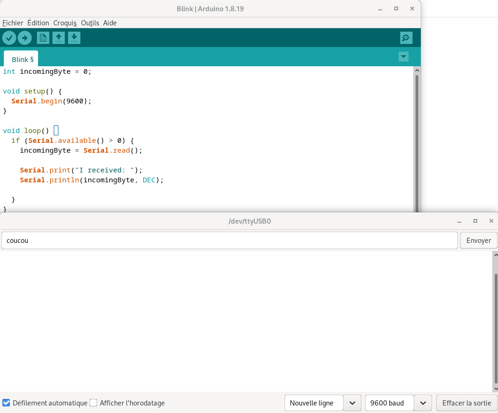

## Prérequis

- Une machine sous **Linux**
  - ⚙️ Démarrer sous Debian sur les machines du département
- [**Arduino IDE**](https://www.arduino.cc/en/software/)
  - ✅ Version 1 disponible sur les machines du département
- [**Visual Studio Code**](https://code.visualstudio.com/)
  - ✅ Disponible sur les machines du département
- [**Node.js**](https://nodejs.org/)
  - ✅ Disponible sur les machines du département

## TD 1 : Découverte de l'environnement

### Exercice 1 : On/Off

> Objectif de l'exercice :
> Allumer et éteindre une LED en introduisant un délai dans la boucle principale.

1. Réaliser le circuit sur le simulateur [Wokwi](https://wokwi.com/projects/new/arduino-uno).
2. Utiliser la fonction [`digitalWrite`](https://docs.arduino.cc/language-reference/en/functions/digital-io/digitalwrite/) pour allumer et éteindre la LED.
3. Utiliser la fonction [`delay`](https://docs.arduino.cc/language-reference/en/functions/time/delay/) pour produire un cycle d'allumage et d'extinction.

### Exercice 2 : PWM

> Objectif de l'exercice :
> Moduler l'intensité lumineuse de la LED.

1. Utiliser la fonction [`analogWrite`](https://docs.arduino.cc/language-reference/en/functions/analog-io/analogWrite/) pour allumer la LED à 50% de son intensité maximale.
2. Introduire des délais pour réaliser un effet de fondu en faisant varier l'intensité de la LED.

### Exercice 3 : communiquer sur liaison série

> Objectif de l'exercice :
> Envoyer et recevoir des caractères entre le PC et l'Arduino *via* la liaison série.
> Pour référence, s'appuyer sur la documentation : [SoftwareSerial.h](https://docs.arduino.cc/learn/built-in-libraries/software-serial/)

1. Vérifier le fonctionnement de l'Arduino en lui envoyant un programme d'exemple (menu *Fichier > Exemples > Basics > Blink*) :

    

2. Écrire du texte sur la liaison depuis l'Arduino et l'afficher sur le PC en utilisant le moniteur série (menu *Outils*) :

    

3. Envoyer une chaîne de caractères depuis le PC, la recevoir sur l'Arduino et afficher les valeurs ASCII des caractères sur le moniteur série :

    

    


4. Vous allez envoyer des **lignes de commande** à l'Arduino, comme vu en CM. Les lignes sont de la forme :

    ```txt
    [cmd 123]
    [[cmd_a 123][cmd_b 456]]
    ```

    - Écrivez un programme pour Arduino capable de recevoir et décoder ces lignes de commande.
    - Faîtes en sorte que différentes commandes reçues déclenchent l'exécution de différentes fonctions. 

### Exercice 4 : communiquer *via* Zigbee

> Objectif de l'exercice :
> Par groupes, communiquer entre PC via Zigbee.
> Un binôme "émetteur", un binôme "récepteur".

L'exercice est à réaliser sous Linux (démarrer sous Debian en salle de TP).

#### Préparation des modules XBee

Deux méthodes sont possibles : soit avec un utilitaire graphique, **XCTU** ; soit par une liaison série via le terminal.

Choisissez l'une ou l'autre de ces deux méthodes, puis passez à la partie **Exercice**.

##### Méthode graphique : XCTU

###### Installation

1. Installez XCTU :
    1. Cliquez sur le lien **Download** de la [page du support Digi XCTU](https://hub.digi.com/support/products/xctu/?path=/support/asset/xctu-v-659-linux-x64/) ;
    2. Rendez exécutable le fichier d'installation téléchargé :

        ```sh
        cd Téléchargements
        chmod +x 40002881_AJ.run
        ./40002881_AJ.run
        ```

    3. Installez XCTU dans un répertoire quelconque préalablement créé (par exemple : `mkdir ~/xctu`).
2. Branchez le module XBee sur votre machine avec le câble USB - XBee.
3. Lancez XCTU et poursuivre avec la configuration. Pour exécuter le programme, lancez la commande suivante depuis un terminal : `~/xctu/XCTU-NG/app`

###### Configuration

1. Lancez XCTU. Ajoutez votre module radio dans XCTU en cliquant sur "*Add device*", en haut à gauche :

    

2. Cliquez sur "*Refresh ports*" puis sélectionnez le port USB correspondant à votre module (en salle TP, `/dev/ACM0`) et cliquez sur "*Finish*" :

    

3. Sélectionnez dans XCTU le module que vous venez d'ajouter. Vous accédez à sa configuration :

    

    Pour une utilisation *point à point*, la configuration doit être identique sur les deux modules XBee :

    - [CH] Channel : canal radio
    - [ID] PAN ID : identifiant du réseau
    - [DH/DL] Destination Address High/Low : adresse 64 bits du second module (et réciproquement)
    - [SH/SL] Serial Number High/Low : adresse 64 bits du module courant
    - [BD] Interface Data Rate : vitesse de transfert (9600 bauds, soit 960 octets/seconde)
    - [MM] MAC Mode : 802.15.4
    - [AP] API Enable : 0 (on utilise les commandes le mode transparent **AT**)

4. Une fois la configuration effectuée, validez en cliquant sur "*Write*".

##### Méthode terminal : `screen`

En utilisant les commandes **AT** :

1. Utiliser `screen` pour ouvrir un terminal série :

    ```sh
    screen /dev/ttyACM0 9600
    ```

2. Envoyer la série de commandes suivantes (taper "dans le vide" et valider avec Entrée) :

    ```txt
    +++             (démarrage de la session, retourne "OK")
    ATID 1234       (PAN ID = 0x1234)
    ATCH 0C         (canal = 0x0C)
    ATAP 0          (mode transparent)
    ATSH            (voir les 32 bits de la partie haute de sa propre adresse)
    ATSL            (voir les 32 bits de la partie basse de sa propre adresse)
    ATDH 0013A200   (exemple : partie haute de l'adresse du module destination)
    ATDL 40B9ABCD   (exemple : partie basse de l'adresse du module destination)
    ATBD 3          (baudrate = 9600)
    ATWR            (écrire)
    ATCN            (quitter)
    ```

#### Exercice

1. Créez un projet Node.js :

    ```sh
    mkdir td-xbee
    cd td-xbee
    npm init
    ```

2. Installez la bibliothèque `serialport` dans votre projet :

    ```sh
    npm install serialport
    ```

3. Créez deux fichiers, `sender.js` et `receiver.js`. Voici des squelettes, à compléter :

    ```js
    // sender.js

    // Importer la bibliothèque serialport
    const { SerialPort } = require('serialport');

    // Configurer le chemin du port série
    const PORT = '/dev/ttyACM0';
    // Configurer le baudrate
    const BAUD = 9600;
    // Le message à envoyer
    const MSG = 'Coucou';

    // Instancier l'objet SerialPort
    const port = new SerialPort({ path: PORT, baudRate: BAUD });

    // Deux événements nous intéressent :
    // Événement : ouverture du port série
    port.on('open', () => {
      // Confirmer l'ouverture du port en affichant son chemin et le baudrate
      console.log(...);
      // Transformer la chaîne de caractères en séquence d'octets
      const payload = Buffer.from(MSG, 'utf8');
      // Écrire la séquence sur le port série
      port.write(payload, (err) => {
        // Vérifier qu'il n'y a pas d'erreur
        if (...)
        // Confirmer l'envoi du message en affichant le nombre d'octets transmis
        console.log(...);
      });
    });
    // Événement : Erreur
    port.on('error', (err) => console.error('Serial error:', err));
    ```

    ```js
    // receiver.js
    
    // Importer la bibliothèque serialport
    const { SerialPort } = require('serialport');

    // Configurer le chemin du port série
    const PORT = '/dev/ttyACM0';
    // Configurer le baudrate
    const BAUD = 9600;

    // Instancier l'objet SerialPort
    const port = new SerialPort({ path: PORT, baudRate: BAUD });

    // Trois événements nous intéressent :
    // Événement : Ouverture du port série
    port.on('open', () => {
      // Confirmer l'ouverture du port en affichant son chemin et le baudrate
      console.log(...);
    });
    // Événement : Réception de données
    port.on('data', (buf) => {
      // Convertir la séquence d'octets en chaîne de caractères
      const text = ...
      // Afficher le message reçu
      console.log(...);
    });
    // Événement : Erreur
    port.on('error', (err) => console.error('Serial error:', err));
    ```

4. Pour exécuter vos programmes, utilisez la commande `node` :

    ```sh
    node receiver.js # côté récepteur
    node sender.js   # côté émetteur
    ```

## TD 2 : comportement autonome avec un contrôleur PID

Équation d'un contrôleur PID en temps continu :

\[
u(t) = K_p \cdot e(t) + K_i \cdot \int_0^t e(\tau) \, d\tau + K_d \cdot \frac{de(t)}{dt}
\]

Et en version discrète, pour un implantation numérique :

\[
u[n] = K_p \cdot e[n] + K_i \cdot \sum_{i=0}^{n} e[i] + K_d \cdot (e[n] - e[n-1])
\]

Expliquer le rôle de chacune des composantes de la fonction discrète du PID, sachant que :

- \(u[n]\) : commande envoyée au système au pas de temps \(n\)
- \(e[n]\) : erreur mesurée au pas de temps \(n\) (exemple : \(distance_{cible} - distance_{mesurée}\))

Pour simplifier :

- erreur proportionnelle \(e_p\) : distance mesurée – distance voulue
- erreur intégrale \(e_i\) : somme des \(e_p\) calculées précédemment
- erreur dérivée \(e_d\) : \(e_{p}[n]\) - \(e_{p}[n-1]\)

### Exercice 1 : composante proportionnelle (P)

*Comment le terme proportionnel influence-t-il la réaction du robot ?*

> Un robot doit maintenir une distance de 10 cm avec un mur lorsqu'il le longe.
> Sa distance actuelle au mur est de 6 cm.

1. Que signifie \(e[0]\) ? Calculez sa valeur.
2. Si le gain proportionnel \(K_p = 0.5\), quelle est la correction appliquée ?
3. Que se passe-t-il si \(K_p = 2\) ?

### Exercice 2 : composante intégrale (I)

*Comment l'intégrale corrige les erreurs persistantes ?*

> Le robot reste trop près du mur pendant plusieurs secondes...
> Aux trois derniers pas de temps : \(e[0] = 4, e[1] = 4, e[2] = 4\)

1. Calculer la correction totale après 3 mesures.
2. Si le gain intégral \(K_i = 0.1\), quelle est la part due à l'intégrale ?
3. Que se passe-t-il si \(K_i\) est trop grand ?

### Exercice 3 : composante dérivée (D)

*Comment la dérivée anticipe les changements rapides ?*

> Le robot s'éloigne du mur.
> Aux deux derniers pas de temps : \(e[2] = 4, e[3] = 1\)

1. Calculer la variation d'erreur.
2. Pour un gain dérivé \(K_d = 02\), calculer la correction appliquée.
3. Quelle est la correction totale ?

### Exercice 4 : pertinence des composantes

*Comment diagnostiquer un mauvais réglage du contrôleur ?*

> Le robot oscille autour du seuil cible.
> Le robot corrige trop lentement sa trajectoire.
> Le robot dépasse systématiquement le seuil cible.

1. Que dire de \(K_p\), \(K_i\) et \(K_d\) dans chacune de ces trois situations ?
2. Comment peut-on corriger ces dysfonctionnements ?

## TD 3 : distribution du calcul et étude des compromis

### Exercice 1 : temps de calcul et fréquence de lecture

> Le capteur VL53L1X peut mesurer jusqu'à **50 Hz** (soit une mesure toutes les 20 ms).
> - Arduino Uno à 16 MHz
> - Temps de calcul d'un PID simple : \~1 ms
> - Temps de lecture du capteur : \~20 ms

1. Quelle est la fréquence maximale théorique de la boucle PID ?
2. Que se passe-t-il si l'on veut lire le capteur à 100 Hz ?
3. Proposez une fréquence raisonnable pour un robot roulant à 0.5 m/s.

### Exercice 2 : occupation mémoire du PID

> On veut stocker un historique de 100 erreurs pour calculer un PID discret.
> - Arduino Uno : 2 Ko de RAM
> - Chaque erreur est un `float` (4 octets)

1. Quelle quantité de mémoire est utilisée pour stocker 100 erreurs ?
2. Quelle est la mémoire restante pour le reste du programme ?
3. Proposer une solution pour réduire l'empreinte mémoire sans perdre trop de précision.

### Exercice 3 : énergie et efficacité

> Un robot utilise un PID mal réglé qui provoque des oscillations.
> - Les moteurs consomment 100 mA en ligne droite
> - En cas d'oscillations : consommation moyenne = 150 mA
> - Batterie = 1000 mAh

1. Quelle est l'autonomie du robot avec et sans oscillations ?
2. Quel est le gain en autonomie si le PID est bien réglé ?
3. Quelle stratégie PID permet de réduire les oscillations ?

### Exercice 4 : précision et bruit de mesure

> Le capteur VL53L1X a une précision de ±5% et une résolution de 1 mm.
> - Distance réelle = 200 mm
> - Mesures successives : 198, 202, 195, 205, 200

1. Calculez l'erreur moyenne et l'écart-type.
2. Quelle est l'influence du bruit sur le terme dérivé du PID ?
3. Proposez une méthode pour filtrer les mesures avant le calcul du PID.

### Exercice 5 : latence dans une architecture distribuée

> Pour économiser les ressources de l'Arduino, on propose de transférer le calcul du PID vers un PC. L'Arduino envoie les mesures via XBee, et reçoit en retour les commandes calculées.
> - Capteur VL53L1X : mesure toutes les 20 ms
> - Latence XBee (aller-retour) : \~50 ms
> - Temps de calcul PID sur PC : 1 ms
> - Vitesse du robot : 0.5 m/s

1. Quelle est la latence totale entre la mesure et l'application de la commande ?
2. Quelle distance le robot parcourt pendant cette latence ?
3. Est-ce acceptable pour un robot devant éviter des obstacles à 20 cm ?
4. Proposez une stratégie pour réduire l'impact de cette latence (*e.g.* prédiction, calcul local, hybridation).
